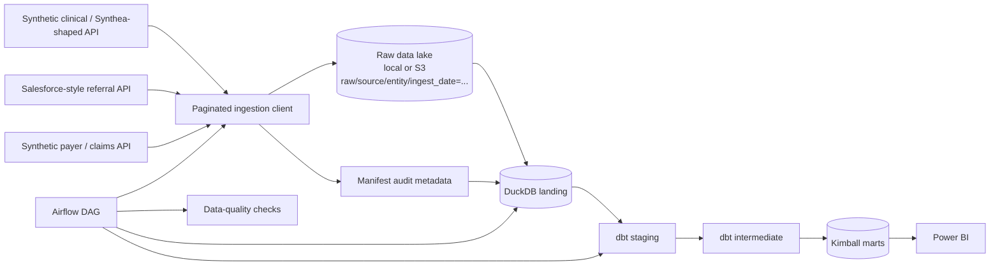
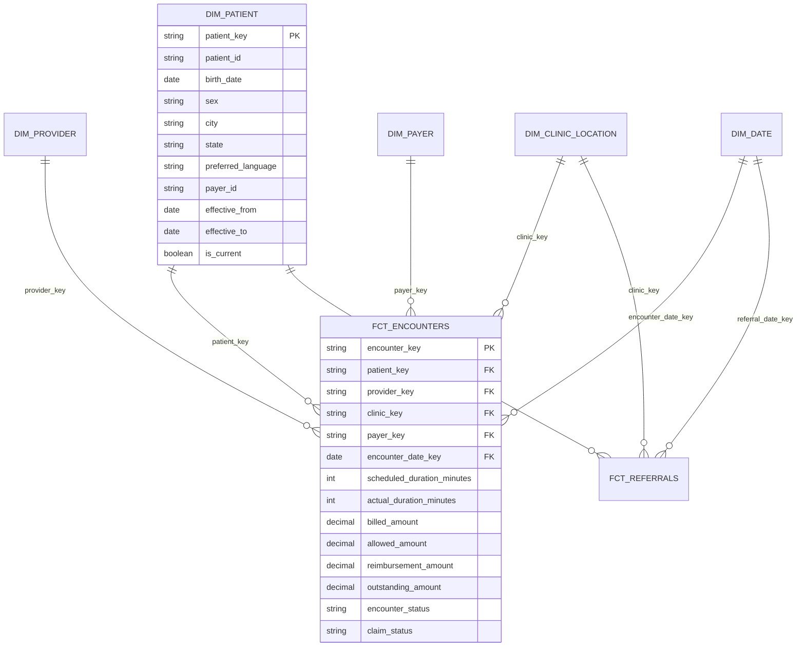

# Clinic Ops Data Warehouse

A portfolio-scale healthcare operations data platform that ingests three synthetic source domains into an S3-style raw data lake, stages them in DuckDB, builds a Kimball dimensional warehouse with dbt, runs data-quality checks, orchestrates the flow with Airflow, and exposes reporting marts designed for Power BI.

> **Privacy / PHI statement:** This repository contains and generates **synthetic data only**. It is intentionally designed so the project can demonstrate healthcare-data engineering patterns without using real patient information or PHI. It should not be represented as a production HIPAA-compliant system.

## Why this project exists

The project is designed around a realistic clinic-operations use case:

- ingest clinical encounter/session data;
- ingest Salesforce-style referral and intake data;
- ingest payer/claim and reimbursement data;
- retain immutable raw snapshots with audit metadata;
- model data at stable Kimball grains;
- preserve patient profile history with SCD Type 2 logic;
- expose utilization, reimbursement, and referral-funnel metrics;
- document and verify AI-assisted coding work.

Synthea is an open-source synthetic-patient generator built for realistic-but-not-real health records and supports formats including CSV and FHIR. The repo includes a Synthea-shaped synthetic fixture generator for zero-config demos plus an adapter script for normalizing actual Synthea CSV exports if you choose to generate them separately.

## Architecture



### Raw lake object convention

```text
raw/
  clinical/
    encounters/ingest_date=2026-08-10/part-00000.jsonl
  crm/
    referrals/ingest_date=2026-08-10/part-00000.jsonl
  finance/
    claims/ingest_date=2026-08-10/part-00000.jsonl

_manifests/
  ingest_date=2026-08-10/manifest.jsonl
```

Every manifest entry stores source, entity, object key, row count, byte count, SHA-256, and ingestion timestamp.

## Source domains

| Source domain | Portfolio analogue | Main entities |
|---|---|---|
| `clinical` | third-party clinical/EHR API or Synthea export | patients, providers, clinics, encounters |
| `crm` | Salesforce-style referral/intake source | patient profile history, referrals |
| `finance` | payer/claims feed | payers, claims |

The mock APIs paginate records so the ingestion path behaves like a real external API instead of simply copying a CSV into a warehouse.

## Kimball model

**Primary fact grain:** one row per patient encounter/session.



### Why SCD Type 2 matters here

`dim_patient` retains historical patient profile versions. When a payer or profile attribute changes, the old row is closed and a new row becomes current. `fct_encounters` joins to the patient version that was effective **on the encounter date**, not simply the latest version.

That lets historical utilization and financial reports remain consistent with the profile context that existed at the time of care.

## Repository layout

```text
src/clinic_ops/          core package
scripts/                 runnable pipeline and verification commands
transform/               dbt project
orchestration/dags/      Airflow DAG
dashboards/power_bi/     model instructions, DAX, and report spec
docs/                    data dictionary, privacy, and design notes
tests/                   unit/contract tests
warehouse/               local DuckDB target (generated, not committed)
```

## Quick start

### 1. Create an environment

```bash
python3 -m venv .venv
source .venv/bin/activate
pip install -r requirements.txt
pip install -e .
```

### 2. Run the full local demo

```bash
make demo
```

`make demo`:

1. generates deterministic synthetic fixtures;
2. starts the local paginated REST API;
3. ingests all entities into a partitioned local data lake;
4. loads the selected snapshot into DuckDB landing tables;
5. runs staging DQ;
6. executes `dbt build`;
7. runs mart DQ;
8. writes `artifacts/verification_report.json`.

### Run steps individually

Terminal 1:

```bash
make generate
make api
```

Terminal 2:

```bash
make ingest INGEST_DATE=2026-08-10
make stage INGEST_DATE=2026-08-10
make dq-staging INGEST_DATE=2026-08-10
make dbt
make dq-marts INGEST_DATE=2026-08-10
```

## S3 mode

Local mode is the zero-cost default. To use a real S3 bucket:

```bash
export LAKE_BACKEND=s3
export S3_BUCKET=your-bucket-name
export S3_PREFIX=clinic-ops
export AWS_REGION=us-east-1

python scripts/ingest.py --ingest-date 2026-08-10
python scripts/load_staging.py --ingest-date 2026-08-10
```

The same object-key structure is used in both local and S3 modes.

Do not commit AWS credentials. Use standard AWS credential resolution (environment, profile, or role).

## Using official Synthea CSV instead of generated clinical fixtures

The default demo creates Synthea-shaped synthetic records so the repository runs without a separate Java setup.

If you generate official Synthea CSV files, normalize them into the mock API fixture contract:

```bash
python scripts/import_synthea_csv.py \
  --synthea-dir /path/to/synthea/output/csv \
  --output-dir fixtures
```

The adapter intentionally uses only the columns needed for clinic operations. This is also a useful data-minimization discussion point.

## Data quality

Staging checks include:

- natural-key null checks;
- duplicate-key checks;
- encounter → patient/provider/clinic referential integrity;
- claim → encounter/patient/payer referential integrity;
- referral/profile → patient referential integrity;
- current landed row counts vs. ingestion manifest;
- current source row counts vs. the previous ingestion snapshot when one exists.

dbt tests include:

- `unique` and `not_null` surrogate keys;
- fact-to-dimension `relationships`;
- uniqueness of encounter grain;
- valid patient SCD2 current-row behavior.

Mart checks include:

- no duplicate encounter facts;
- one fact row per landed encounter;
- non-null dimension foreign keys;
- no negative reimbursement/outstanding measures;
- no more than one current SCD2 row per patient.

## Airflow

Install Airflow separately because it is a large dependency:

```bash
pip install -r requirements-airflow.txt
```

The DAG is in:

```text
orchestration/dags/clinic_ops_daily.py
```

It sequences:

```text
ingest
  -> load_staging
  -> staging_dq
  -> dbt_build
  -> mart_dq
  -> write_bi_refresh_flag
```

Airflow 3 exposes stable DAG/task authoring interfaces through `airflow.sdk`; the project uses the TaskFlow style rather than packing transformation logic into the DAG itself.

## Power BI

The repository does not fabricate a `.pbix` binary. Instead, `dashboards/power_bi/` contains:

- the relationship model to recreate;
- DuckDB mart/view names;
- DAX measures;
- three report-page specifications;
- validation checks for totals.

Build these pages:

1. **Clinic Utilization** — encounter volume, completed care hours, no-show rate, provider/clinic trends.
2. **Payer Financials** — billed, allowed, reimbursed, outstanding, denial rate by payer and month.
3. **Referral Funnel** — referral → intake → converted counts and conversion rate by channel/clinic.

That gives you a real Power BI artifact you can create and screenshot without claiming ChatGPT generated a proprietary `.pbix`.

## AI-assisted workflow

`AGENTS.md` is the context file for coding assistants. It defines:

- naming conventions;
- fact-table grains;
- SCD2 rules;
- raw-layer immutability;
- test expectations;
- a don't-touch list for model contracts.

`AI_WORKLOG.md` records how AI was used and, importantly, what the developer corrected and how it was verified.

A defensible interview description is:

> I used an AI coding assistant to accelerate boilerplate and SQL scaffolding, but I treated its output as untrusted. I verified source contracts, checked join fanout against manifest counts, ran dbt relationship/uniqueness tests, and only accepted changes after the staging and mart DQ suites passed.

Do **not** claim a specific bug was caught unless you actually encountered and documented it.

## Verification before publishing

Run:

```bash
make verify
```

Then inspect:

```text
artifacts/verification_report.json
artifacts/dq_staging.json
artifacts/dq_marts.json
```

## References

- Synthea: https://synthetichealth.github.io/synthea/
- Synthea source: https://github.com/synthetichealth/synthea
- dbt dimensional modeling: https://docs.getdbt.com/blog/kimball-dimensional-model
- Apache Airflow docs: https://airflow.apache.org/docs/apache-airflow/stable/
